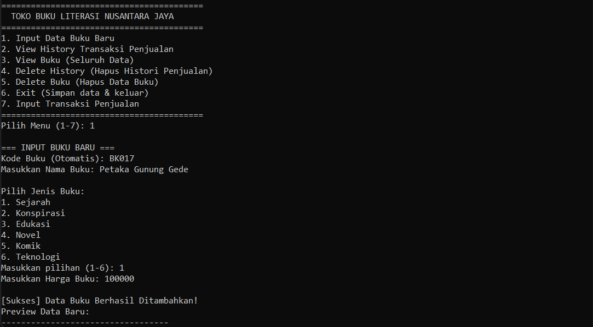

# Bookstore "Literasi Nusantara Jaya" - Transaction Monitoring (C Language)

A simple transaction monitoring application designed to support the digitalization of inventory and sales recording at the "Literasi Nusantara Jaya" bookstore. This project is built using the C programming language with a modular approach.

## 📸 Preview


## 🚀 Key Features
- **Modular Architecture**: Code is split into multiple files (`.h` and `.c`) for better readability and maintainability.
- **Book Data Management**: 
    - Automatic book code generation (`BK001`, `BK002`, etc.).
    - Predefined book categories (History, Novel, Education, etc.).
    - Descending view of book lists (newest data at the top).
- **Sales Transactions**: 
    - Transaction recording based on book codes.
    - Automatic calculation of total prices.
- **Data Persistence**: 
    - Automatic saving to `databuku.txt` and `history.txt`.
    - Auto-generation of files and dummy data (15 books & 5 history records) upon first execution.
- **Clean Terminal UI**: 
    - Clear Screen feature for each menu transition.
    - Rupiah price formatting with thousands separators (e.g., `Rp 50,000.00`).

## 🛠️ Prerequisites
Ensure that you have a C compiler (GCC/MinGW) installed on your system.
For Windows users, make sure `gcc` is added to your system's Environment Path.

## 💻 How to Run

### 1. Compilation
Open a terminal/command prompt in the project folder and run the following command:
```powershell
gcc main.c bookstore.c -o main
```

### 2. Execution
Once compiled successfully, run the executable file:
```powershell
.\main.exe
```

## 📂 Folder Structure
- `main.c`: Contains the main menu logic and program loop.
- `bookstore.h`: Header file containing struct declarations and function prototypes.
- `bookstore.c`: Implementation of business logic and file management.
- `databuku.txt`: Storage for book data.
- `history.txt`: Storage for transaction history records.

## 📝 Application Menus
1. **Input New Book Data**: Add book inventory with predefined categories.
2. **View Sales History**: View all transaction history records.
3. **View Books**: View available book inventory (Newest at the top).
4. **Delete History**: Delete a specific record from the sales history.
5. **Delete Book**: Delete a specific book record.
6. **Exit**: Save all changes to `.txt` files and exit the program.
7. **Input Sales Transaction**: Record a new sales entry.

---
**Created for Algorithm & Programming Lab Assignment Binus Online Learning.**
